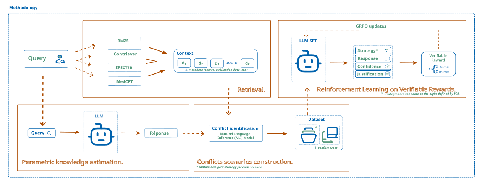

# ARC Phase 1 Conflict Pipeline

This workspace is a reusable Python project for Phase 1 of the methodology:

1. retrieve biomedical contexts with MedRAG retrievers,
2. estimate parametric knowledge through repeated LLM probes,
3. normalize retrieved and parametric evidence into one source format,
4. detect Inter-Context (IC), Context-Memory (CM), and Inter-Memory (IM)
   conflicts with one agnostic NLI comparison path,
5. write scenario records as JSONL.

<p align="center">
  
</p>

## Project Layout

```text
. 
+-- images/
|   +-- methodology.svg
+-- requirements.txt
+-- src/
    +-- cli.py              # command line runner
    +-- config.py           # environment-driven settings
    +-- conflicts.py        # agnostic IC, CM, and IM conflict detector
    +-- datasets.py         # PubMedQA, MMLU-Med, MedQA-US, MedMCQA loaders
    +-- environment.py      # Colab/MedRAG/StatPearls setup helpers
    +-- nli.py              # NLI model wrapper
    +-- pipeline.py         # end-to-end scenario builders
    +-- pke.py              # parametric knowledge estimation
    +-- sft_dataset.py      # stratified SFT/GRPO/validation/test split builder
    +-- retrieval.py        # MedRAG retrieval manager
    +-- utils.py            # JSONL helpers
```

```text
+-- notebooks/
    +-- run_mmlu_med_from_gitlab.ipynb
    +-- run_medqa_us_from_gitlab.ipynb
    +-- run_medmcqa_from_gitlab.ipynb
    +-- run_sft_dataset_from_gitlab.ipynb
```

## Requirements

The pipeline is designed for a Colab or GPU Linux environment. Dense retrieval,
NLI, and PKE models can be memory intensive.

System packages:

```bash
apt-get install -y openjdk-21-jdk-headless git git-lfs wget
```

Python packages:

```bash
pip install -r requirements.txt
```

## Configuration

Defaults are defined in `.env` and can still be overridden by exported
environment variables.

Core variables:

```bash
USE_DRIVE=true
DRIVE_ROOT=/content/drive/MyDrive/arc_phase1
LOCAL_ROOT=/content/arc_phase1
LOCAL_EMBED_DIR=/content/pubmed_embeddings
HF_TOKEN=
CORPUS_NAME=MedText
TOP_K=3
RETRIEVERS=BM25,Contriever,SPECTER,MedCPT
DEFAULT_N_QUESTIONS=10
NLI_MODEL=cross-encoder/nli-deberta-v3-small
PKE_MODEL=Qwen/Qwen2.5-3B-Instruct
N_PROBES=7
```

Do not hardcode Hugging Face tokens in source files. Use the standard CLI login
or environment variables when a private or gated model requires authentication.

## Run

From the repository root:

```bash
python -m src.cli --dataset pubmedqa --n-questions 10
```

This writes:

```text
${ROOT_DIR}/outputs/phase1_scenarios_10q.jsonl
```

Run the MMLU-Med variant:

```bash
python -m src.cli --prepare-statpearls --dataset mmlu-med --n-questions 10 --output mmlu_med_scenarios.jsonl
```

Run MedQA-US (USMLE 4-option):

```bash
python -m src.cli --prepare-statpearls --dataset medqa-us --n-questions 10 --output medqa_us_scenarios.jsonl
```

Run MedMCQA (default split: `validation`, as `test` labels are private):

```bash
python -m src.cli --prepare-statpearls --dataset medmcqa --split validation --n-questions 10 --output medmcqa_scenarios.jsonl
```

Summarize mutually exclusive question sets from a generated JSONL dataset:

```bash
python -m src.summarize_conflicts /path/to/scenarios.jsonl
```

The unit is the question. A question is counted once in exactly one exclusive
set, for example `NO_CONFLICT`, `IC`, `CM`, `IM`, `CM_IC`, `IC_IM`,
`CM_IC_IM`. The script also prints a secondary non-exclusive view showing how
many questions contain each conflict type at least once.

For machine-readable output:

```bash
python -m src.summarize_conflicts /path/to/scenarios.jsonl --json
```

In Colab, add `--mount-drive` if you want the runner to mount Google Drive:

```bash
python -m src.cli --mount-drive --dataset pubmedqa --n-questions 10
```

If BM25 over StatPearls needs the notebook workaround, pass
`--prepare-statpearls`. This runs MedRAG's StatPearls chunking script from the
right working directory before retriever initialization:

```bash
python -m src.cli --prepare-statpearls --dataset pubmedqa --n-questions 10
```

## Stratified Split Construction

The split builder reads a `scenarios.jsonl` file, computes a normalized
`conflict_category` for each `query_id`, and produces four disjoint files:
`sft_train.jsonl`, `grpo_train.jsonl`, `val.jsonl`, and `test.jsonl`.

The global split is stratified at 80/10/10 by `conflict_category`. The train
set is then split again into SFT and GRPO, keeping all `sans_conflit` samples
inside SFT and sampling the remaining SFT budget proportionally with a minimum
of 20 examples per conflict category.

Run it from the repository root:

```bash
python -m src.sft_dataset data/scenarios_merged.jsonl --output-dir data
```

The command writes:

```text
data/sft_train.jsonl
data/grpo_train.jsonl
data/val.jsonl
data/test.jsonl
```

The notebook runner is available at
[notebooks/run_sft_dataset_from_gitlab.ipynb](/home/beryl/Documents/M2-IMSP/master-thesis/ARC/notebooks/run_sft_dataset_from_gitlab.ipynb).

## A100 GRPO Arbitration Baseline

The GRPO baseline for the thesis is configured for a single NVIDIA A100 SXM
80GB:

```bash
bash scripts/run_grpo_a100.sh
```

Effective configuration:

```text
model: Qwen/Qwen2.5-3B-Instruct
quantization: 4-bit NF4, double quantization
compute dtype: BF16
LoRA: r=16, alpha=32, dropout=0.05
LoRA target modules: q_proj,k_proj,v_proj,o_proj
num_generations: 8
max_prompt_length: 4096
max_completion_length: 256
per_device_train_batch_size: 1
gradient_accumulation_steps: 8
learning_rate: 1e-6
beta: 0.01
optimizer: paged_adamw_8bit
gradient checkpointing: enabled
vLLM: disabled
```

GRPO prompt budgeting is token-aware and uses the same tokenizer chat template
as training/evaluation. The system message, complete question with A/B/C/D
options, and final JSON instruction are protected. Only retrieved document
content can be shortened. If shortening document content is still insufficient,
documents are removed deterministically from the end of the existing retrieval
order. Completion length remains independent: prompt overflow never reduces
`max_completion_length`. If the protected components alone exceed 4096 tokens,
the example is rejected with a warning and recorded.

Before training, the GRPO script computes prompt statistics over the actual
dataset, including before/after token lengths, truncation and rejection rates,
tokens removed, and documents removed. It writes
`prompt_budget_diagnostics.json` and `training_config.json` in the output
directory for reproducibility.

## Output Schema

Each JSONL line is one scenario:

```json
{
  "query_id": "string",
  "query": "string",
  "gold_answer": "string",
  "conflicts": [
    {
      "conflict_id": "string",
      "type": "IC",
      "nli_label": "contradiction",
      "nli_score": 0.91,
      "conflictual_element": [
        {
          "source_type": "retrieved",
          "rank": 1,
          "score": 12.4,
          "document_id": "string",
          "title": "string",
          "text": "string",
          "source_corpus": "MedText",
          "retriever": "BM25",
          "content": null
        }
      ]
    }
  ],
  "non_conflictual_elements": [
    {
      "source_type": "parametric",
      "rank": 1,
      "score": 0.0,
      "document_id": "probe_1",
      "title": "Parametric probe 1",
      "text": "string",
      "source_corpus": "parametric",
      "retriever": "Qwen/Qwen2.5-3B-Instruct",
      "content": null
    }
  ]
}
```

Conflict types are inferred from the compared source elements:

```text
retrieved  + retrieved   -> IC
retrieved  + parametric  -> CM
parametric + parametric  -> IM
```

The `conflictual_element` list contains the two elements that contradicted each
other. `non_conflictual_elements` contains every normalized element that was not
part of any detected contradiction.

## Notes

- MedRAG is cloned automatically into `${ROOT_DIR}/MedRAG`.
- Corpus data is stored under `${ROOT_DIR}/corpus`.
- Outputs are stored under `${ROOT_DIR}/outputs`.
- Dense retriever indexes are redirected to `${LOCAL_EMBED_DIR}` when MedRAG
  tries to place them on Google Drive, matching the notebook's performance
  workaround.
- A placeholder `OPENAI_API_KEY` is set only to avoid an eager Pyserini/OpenAI
  client initialization error. This pipeline does not call the OpenAI API.
